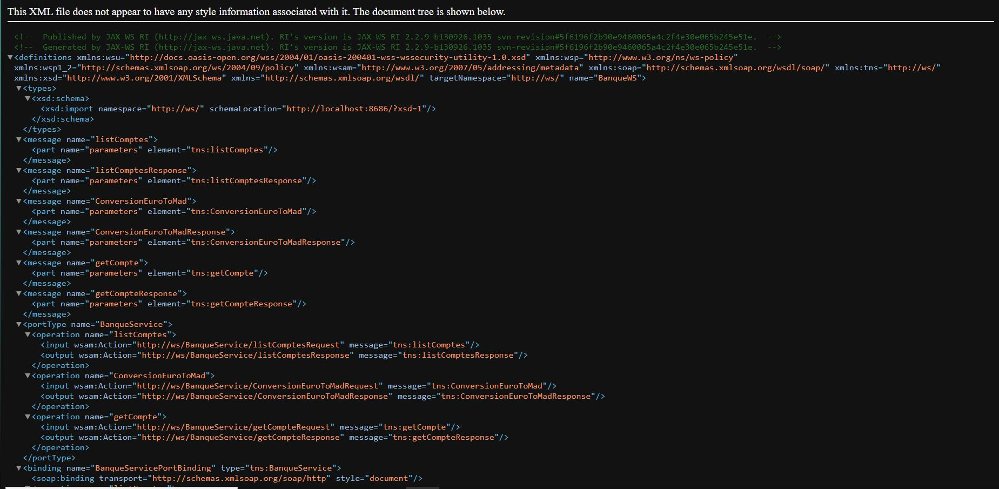
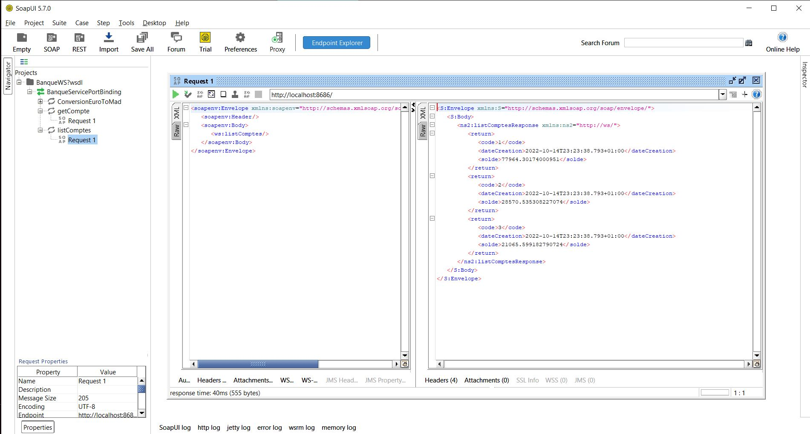
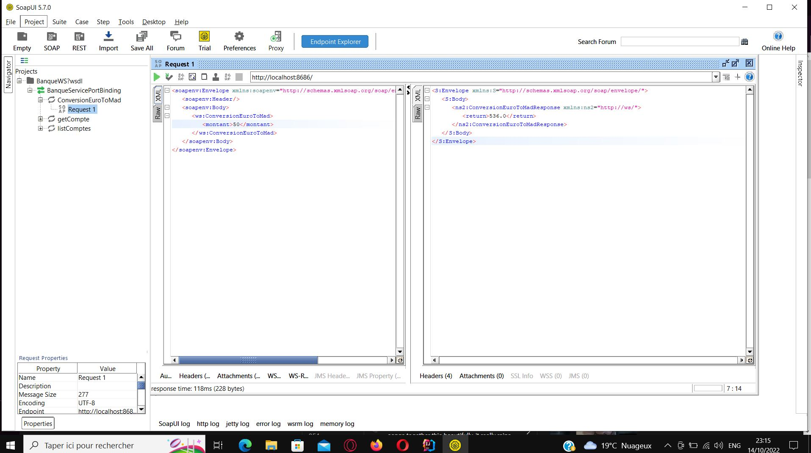

<h2>bankWebService</h2>

<h3>Le fichier WSDL généré après l'exécution du webService</h3>

<h3>SOAP UI: test de la method getCompte pour afficher un compte spécifique</h3>

<h3>SOAP UI: test de la method listCompte pour afficher tous les comptes</h3>

<h3>SOAP UI: test de la method listCompte pour afficher tous les comptes</h3>

<h3>SOAP UI: test de la method conversion pour convertir l'euro en mad</h3>

<h4>ISSAM FLADI</h4>
